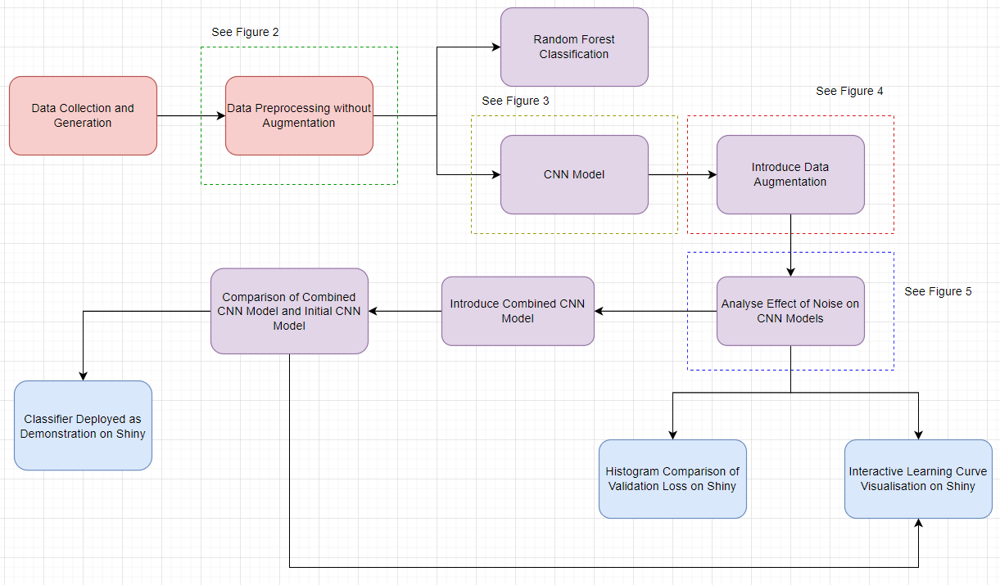

```{r, load_refs, echo=FALSE, cache=FALSE, message=FALSE, warning=FALSE}
library(RefManageR)
BibOptions(check.entries = FALSE, 
           bib.style = "authoryear", 
           cite.style = 'authoryear', 
           style = "markdown",
           hyperlink = FALSE, 
           dashed = FALSE)
myBib <- ReadBib("Presentation_files/assets/example.bib", check = FALSE)
top_icon = function(x) {
  icons::icon_style(
    icons::fontawesome(x),
    position = "fixed", top = 10, right = 10
  )
}

library(tidyverse)
library(gridExtra)
library(lattice)
library(ggplot2)
library(caret)
library(ggfortify)
library(kableExtra)
library(plotly)
library(dplyr)
```


## PROJECT CONTEXT 

**Motivation:** Developing a robust computer vision tool, since cell images can be affected by various factors leading to errors in image analysis & classification (Rączkowski et al., 2019). 


**Robustness:** refers to the ability of an image analysis model to maintain reliable results even in the presence of variations in the input images (Drenkow et al., n.d.). 


**Project Questions:**
- Q1: Investigating how the model's performance & robustness vary with different types & levels of noise levels, image resolution, & image artifacts. 

- Q2: How can data augmentation be used to improve the robustness of the model to variations in input image quality?
---


## DATASET

- Biotechnology Data Bundle

- [Biotechnology generate Images report](https://www.10xgenomics.com/resources/datasets/fresh-frozen-mouse-brain-for-xenium-explorer-demo-1-standard)


---
class: segue-red

# Baseline Model 


.left[.footnote[

```
```

]]

---
Figure 1: Workflow Diagram

```{r echo=FALSE, out.width="600px", out.height="600px", fig.align='center'}


```


---
Figure 2: Data Pre-processing without augmentations


---
Figure 3: CNN Model


---
class: segue-red

# Data Augmentation


.left[.footnote[

```

```

]]


---

## Choice of Data Augmentations

Data augmentation is a technique used to help reduce over-fitting (Shorten & Khoshgoftaar, 2019). 

Three data augmentation factors:

- noise

- rotation

- resolution

---
Figure 4: Pre-processing with augmentations


---

## RESULTS

Shiny App link


---
## INTERPRETATION

Figure 5: Analyse Effects of Noise on CNN Models


---
class: segue-red

# Discussion


.left[.footnote[

```

```

]]

---
## CONCLUSION


---


## LIMITATIONS


---


## FUTURE STUDY 


---

## REFERENCES


