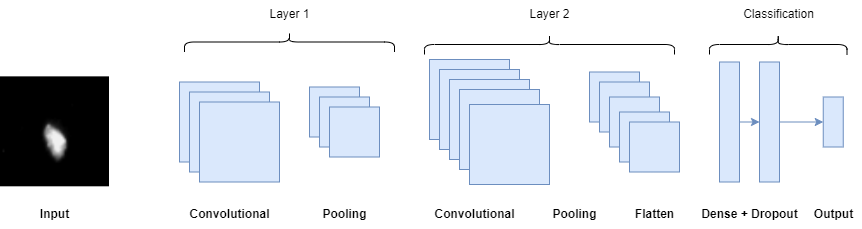

```{r, load_refs, echo=FALSE, cache=FALSE, message=FALSE, warning=FALSE}
library(RefManageR)
BibOptions(check.entries = FALSE, 
           bib.style = "authoryear", 
           cite.style = 'authoryear', 
           style = "markdown",
           hyperlink = FALSE, 
           dashed = FALSE)
myBib <- ReadBib("Presentation_files/assets/example.bib", check = FALSE)
top_icon = function(x) {
  icons::icon_style(
    icons::fontawesome(x),
    position = "fixed", top = 10, right = 10
  )
}

library(tidyverse)
library(gridExtra)
library(lattice)
library(ggplot2)
library(caret)
library(ggfortify)
library(kableExtra)
library(plotly)
library(dplyr)
```


## PROJECT CONTEXT 

**Project Questions:**
- Q1: Investigating how the model's performance & robustness vary with different types & levels of noise levels, image resolution, & image artifacts. 

- Q2: How can data augmentation be used to improve the robustness of the model to variations in input image quality?
---


## DATASET

[Biotechnology Generate Images Report](https://www.10xgenomics.com/resources/datasets/fresh-frozen-mouse-brain-for-xenium-explorer-demo-1-standard)

Image: Frozen Mouse Brain (Mouse Brain Dataset Explorer, n.d.)

```{r echo=FALSE, out.width="615px", out.height="450px", fig.align='center'}
knitr::include_graphics("images/Data_Collection.png")

```


---
Figure 1: Workflow Diagram

```{r echo=FALSE, out.width="600px", out.height="550px", fig.align='center'}


```


---
class: segue-red

# Baseline Model 


.left[.footnote[

```
```

]]

---


Figure 2: CNN Model 


```{r echo=FALSE, class = "middle"}


```


---
class: segue-red

# Data Augmentation


.left[.footnote[

```

```

]]


---
Figure 3: Evaluation Strategy 


```{r echo=FALSE, out.width="600px", out.height="550px", fig.align='center'}


```


---
class: segue-red

# Results


.left[.footnote[

```

```

]]


---
```{r echo=FALSE, out.width="615px", out.height="615px", fig.align='center'}


```

---
```{r echo=FALSE,out.width="615px", out.height="615px", fig.align='center'}


```

---
```{r echo=FALSE,out.width="615px", out.height="615px", fig.align='center'}


```

---

RESULTS Q2

screen-record of 'visualisation' section in shiny app


---
class: segue-red

# Discussion


.left[.footnote[

```

```

]]

---
## CONCLUSION

- screen-record of the 'Demonstration' app part


---


## LIMITATIONS


---


## FUTURE STUDY 

- **Improving Model:** Run the model multiple times to get the average validation accuracy = more reliable 

- **Medial Analysis:** Validated our model on three different medial case studies: skin melanomas diagnosis, histopathological images, & breast magnetic resonance imaging (MRI) scans analysis, utilising the image classification in order to produce a diagnose (Mikołajczyk & Grochowski, 2018). 


---

## Q & A 


---
## REFERENCES

.scroll-output[
Bishop, C. M. (1995). Training with Noise is Equivalent to Tikhonov Regularization. Neural Computation, 7(1), 108–116. https://doi.org/10.1162/neco.1995.7.1.108

Drenkow, N., Sani, N., Shpitser, I., & Unberath, M. (n.d.). A Systematic Review of Robustness in Deep Learning for Computer Vision: Mind the gap? Retrieved May 1, 2023, from https://arxiv.org/pdf/2112.00639.pdf

Flowchart Maker & Online Diagram Software. (n.d.). App.diagrams.net. Retrieved May 13, 2023, from https://app.diagrams.net/#G1sC_YYsPtNceeaTTMVIXFAJuDiMoDg81P

Image Recognition with Deep Neural Networks and its Use Cases. (n.d.). AltexSoft. Retrieved April 14, 2023, from https://www.altexsoft.com/blog/image-recognition-neural-networks-use-cases/#:~:text=The%20leading%20architecture%20used%20for

Maulana, M. A. (n.d.). Adaptive Computation and Machine Learning series- Deep learning-The MIT Press (2016).pdf. Www.academia.edu. Retrieved April 16, 2023, from https://www.academia.edu/38223830/Adaptive_Computation_and_Machine_Learning_series_Deep_learning_The_MIT_Press_2016_pdf

Mikołajczyk, A., & Grochowski, M. (2018, May 1). Data augmentation for improving deep learning in image classification problem. IEEE Xplore. https://doi.org/10.1109/IIPHDW.2018.8388338

Mouse Brain Dataset Explorer. (n.d.). 10x Genomics. Retrieved May 14, 2023, from https://www.10xgenomics.com/products/xenium-in-situ/mouse-brain-dataset-explorer

Rączkowski, Ł., Możejko, M., Zambonelli, J., & Szczurek, E. (2019). ARA: accurate, reliable and active histopathological image classification framework with Bayesian deep learning. Scientific Reports, 9(1). https://doi.org/10.1038/s41598-019-50587-1

Sabottke, C. F., & Spieler, B. M. (2020). The Effect of Image Resolution on Deep Learning in Radiography. Radiology: Artificial Intelligence, 2(1), e190015. https://doi.org/10.1148/ryai.2019190015

Selvikvåg Lundervold, A., & Lundervold, A. (2018). An overview of deep learning in medical imaging focusing on MRI. Zeitschrift Für Medizinische Physik, 29(2). https://doi.org/10.1016/j.zemedi.2018.11.002

Shanqing; Pednekar, M., & Slater, R. (2019). Improve Image Classification Using Data Augmentation and Neural Networks. SMU Data Science Review, 2(2). https://scholar.smu.edu/cgi/viewcontent.cgi?article=1091&context=datasciencereview

Shorten, C., & Khoshgoftaar, T. M. (2019). A survey on Image Data Augmentation for Deep Learning. Journal of Big Data, 6(1). https://doi.org/10.1186/s40537-019-0197-0

What is Data Augmentation in Image Processing? (n.d.). Www.amygb.ai. Retrieved May 12, 2023, from https://www.amygb.ai/blog/what-is-data-augmentation-in-image-processing
]


