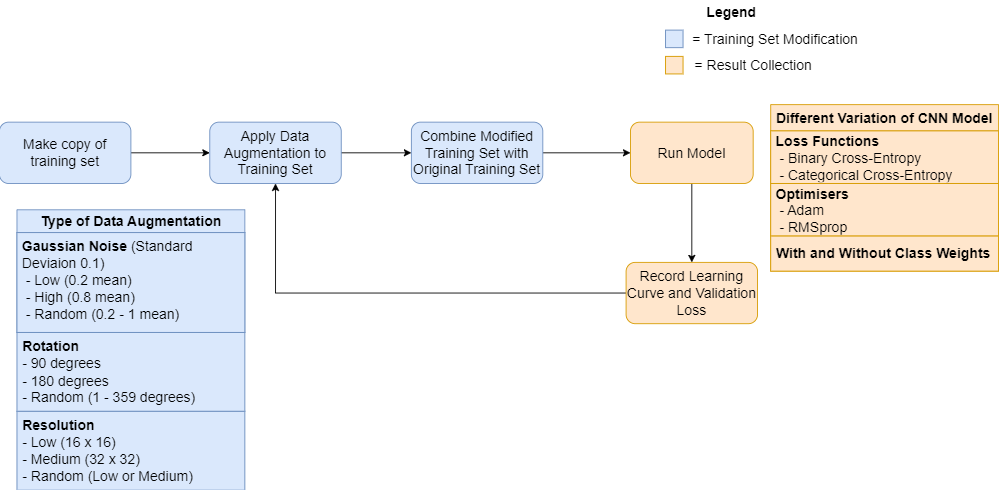

```{r setup, include=FALSE}
knitr::opts_chunk$set(echo = TRUE)
#knitr::opts_chunk$set(fig.pos = '!ht')
library(tidyverse)
library(ggpubr)
library(png)
library(EBImage)
val_loss <- read.csv("Image_App/val_loss.csv")
```

# Executive Summary

The aim of this report is to describe the development and evaluation of a robust computer vision tool, powered by pre-trained deep learning models for precise cell identification from morphological images. This report intends to assess the impact of image quality variations on classification accuracy. Since these models are vital in medical image analysis, the development of novel models that deal with robustness present in images is critical. Data augmentation techniques were applied to address this issue. Gaussian noise, image resolution, and rotation were the three augmentation factors applied in the CNN architecture.
The study found that the application of categorical cross-entropy loss function proves to be effective in reducing validation loss for all three augmentation factors. Also, the introduction of class weights demonstrated effectiveness in addressing class imbalances, and the RMSprop optimiser was found to minimise validation loss in comparison to the Adam optimiser. Overall, the best-performing model was combining all three noise levels (low, high, and random) into one training set, which demonstrated its ability to improve robustness with variation in image quality. 

# Aim and Background

Deep learning models are significant computer vision tools in medical research for understanding cellular structures, diagnosing diseases, and developing new treatments (Chan, 2020). However, there are errors in analysis and classification due to the input image variations. Researcher Rączkowski (2019) highlights that accurate and reliable analysis is significant in disease identification. While researchers, Selvikvåg & Lundervold (2018), also pointed out the impact of various factors on cell image quality. With these issues in mind, the team decided to investigate the theme ‘robustness’. As emphasised by Drenkow, robustness refers to the ability of an image analysis algorithm to maintain its accuracy, even in the presence of variations in the input images. As a result, the report aims to create a robust computer vision tool.

In this investigation, two questions were identified. Question 1: how does the model’s performance vary with different levels of noise, image resolution, and rotation? Question 2: Can data augmentation be used to improve the robustness of the model?

The first question targets the academic community, as researchers, students and teachers would benefit from understanding the robustness of cell image models. This allows them to contribute to the development of new models and the evaluation of previous models. Since medical images make up 90% of all medical data, question 2 was identified for healthcare practitioners (Time, n.d.). A study by Kumar (2022) illustrates deep learning models can be used to classify different cells, from cancer cells to blood cells. However, as mentioned these models can face inconsistencies of input images. Therefore, practitioners would benefit from a robust model developed, helping them make informed decisions about patients (Faes et al., 2019). 

# Method - Data Collection & Developed Models

The dataset was generated by 10x Genomics Xenium instrument on a fresh frozen mouse brain coronal section (Mouse Brain Dataset Explorer, n.d.). The data bundle contained cell boundaries indicating the spatial locations of the detected cells, and RNA abundances for each cell. The cells were then grouped into 28 distinct clusters. An Rmarkdown file was employed to generate the images. This process involved utilising the cell boundaries of the detected cells along with their corresponding labels to create per-cell images for a randomly selected subset of 1000 cells.

Prior to introducing augmentations, several pre-processing steps were employed to optimise the dataset before the introduction of data augmentation. It included the exclusion of noise beyond the cell boundary vertices associated with the cells. Images were also subjected to a mask and resize, and pixel intensities were centered. These steps served to maintain consistency for all images in the dataset. Finally, the dataset size was doubled from 1000 to 2000 due to the high number of cell clusters. This augmentation was able to maintain a minimal increase in training time.

## Baseline Model

Initially, a Random Forest classifier utilising the pixel values of the provided images was employed to predict the corresponding cell clusters. However, it resulted in an error rate of 95%. The reliance of handcrafted features or simple statistical measures from the Random Forest classifier was not effective in capturing the complex and abstract features present in images.

In order to address these issues, convolution neural networks were employed. These neural networks utilise parameterised, sparsely connected kernels which preserve the spatial characteristics of images, allowing complex features to be captured (Shorten, 2019). Furthermore, CNNs can be built on pre-existing networks, which can be retrained for new recognition tasks.

The CNN model architecture implemented in this study consisted of two convolutional layers, followed by pooling layers. Fully connected layers and dropout layers were employed for classification to mitigate overfitting and enhance generalisation capabilities. Code can be found in the appendix. There were in total 1,632,962 trainable parameters available. A binary cross-entropy loss function was employed, along with the Adam optimiser. This decision for a shallow architecture aimed to accommodate for the resource limitations associated with deeper CNN networks and expedite the training process, to achieve interpretable results within the given constraints.

## Model Variations

These model variations offer alternative and more dependable viewpoints regarding the impact of data augmentations on CNN models. They also provide a platform for exploring optimal configurations and settings for future studies in this field. In total, 6 models were used for each augmentation.

### Class Weights

In this particular model variation, class weights were introduced during the training process to address the substantial class imbalance observed in the training set. Greater emphasis was placed on classes with a lower count through, while reducing the importance of classes with a higher count. The implementation can be found in the appendix.

### Categorical Cross-Entropy Loss Function

For this specific model variation, a transition was made from using binary cross-entropy to categorical cross-entropy as the loss function. Categorical cross-entropy is more commonly employed in multi-class classification scenarios involving more than two classes (Rajaraman et al., 2021). Due to the difference mathematically, the validation loss produced by these two loss functions were required to be interpreted in two different scales.

### RMSprop Optimiser

Finally, this model variation utilises RMSprop optimiser instead of the Adam optimiser in the original model. Adam may be more sensitive to hyperparameter settings and can sometimes overfit or converge to suboptimal solutions (Awan et al., 2021). RMSprop, being a simpler algorithm, may be more robust in certain cases and requires fewer hyper parameters to tune.


# Method - Evaluation Strategies 

```{r eval=T, eval_Strat, echo=F, out.width="100%", out.height="30%",fig.show='hold',fig.align='center', fig.cap="Overview of Evaluation Strategy."}

```
Data augmentation was the chosen technique to investigate the robustness of the models. This technique helps reduce overfitting in CNN models, as it minimises the distance between the training and testing set (Shorten, 2019). Noise, resolution and rotation was chosen. Noise expands the training dataset by introducing random variations to input variables (Maulana, n.d.). The addition of noise to the input training set can also lead to improvements in generalisation performance and improve the loss function  (Bishop, 1995) (Shanqing,  2019). While studies have shown that low image resolutions achieve better model performance (Sabottke, 2020) by improving over-fitting, there is a risk in excessively reducing resolution with eliminating important data. This issue was taken into consideration in the method design. Traditional methods like image rotation is a critical strategy in improving model performance, as it is exposed to more angles and diverse observations (Mikołajczyk, 2018).

For the implementation process, the augmented training set was incorporated alongside the original training set. The rotating and resizing augmentations were performed using the EBImage package (Oleś, 2023). To introduce Gaussian noise, a randomly generated number from a normal distribution with a specified mean and a standard deviation of 0.2 was added to each image. The augmented training set was subsequently utilised in training each variation of the CNN model, with the validation loss recorded for each epoch and stored in a CSV file for further analysis and evaluation.

To comprehensively assess the impact of each augmentation, different noise levels were carefully selected. For Gaussian noise, three distinct subcategories were incorporated: low (0.2 mean), high (0.8 mean), and random (0.2 to 1 mean). The same approach was applied to rotation and resizing augmentations. Resizing was limited to below 64 due to the lack of improvement of quality past that. All models were trained for 100 epochs.

Finally, the level that produced the lowest validation for each augmentation was combined to form one single training set, adding up to 6000 samples, which was then fed into the 6 different CNN model variations. The evaluation process was illustrated through Figure 1.

# Results - Effect of Data Augmentation

```{r gausshist, eval=T, include=T, echo=F, fig.width = 15, fig.height = 15, align="center", fig.cap="Bar Charts of Validation Loss for Different Gaussian Noise Levels on CNN Models. Top row includes the charts for Gaussian noise, middle row include charts for Resolution, and bottom row includes charts for rotation.", fig.pos="H"}
level_order <- c("none", "low", "high", "random")

gaussian <- val_loss |> filter((noise_type == "gaussian" | noise_type == "none") & !grepl("Category", model))
gaussian_catent <- val_loss |> filter((noise_type == "gaussian" | noise_type == "none") & grepl("Category", model))

p1 <- ggplot(data = gaussian, aes(x = factor(noise_level, level = level_order), y = val_loss, fill = model)) +
       geom_bar(stat = "identity", position="dodge") +
       xlab("Gaussian Noise Level") + ylab("Validation Loss") +
       ggtitle("Comparison of Validation Loss on Binary and RMSprop Model")
p2 <- ggplot(data = gaussian_catent, aes(x = factor(noise_level, level = level_order), y = val_loss, fill = model)) + 
         geom_bar(stat = "identity", position="dodge") +
         xlab("Gaussian Noise Level") + ylab("Validation Loss") +
         ggtitle("Comparison of Validation Loss on Categorical Model")

level_order_res <- c("none", "low", "medium", "random")
    
resolution <- val_loss |> filter((noise_type == "resolution" | noise_type == "none") & !grepl("Category", model))
resolution_catent <- val_loss |> filter((noise_type == "resolution" | noise_type == "none") & grepl("Category", model))
    
p3 <- ggplot(data = resolution, aes(x = factor(noise_level, level = level_order_res), y = val_loss, fill = model)) +
       geom_bar(stat = "identity", position="dodge") +
       xlab("Resolution") + ylab("Validation Loss") +
       ggtitle("Comparison of Validation Loss on Binary and RMSprop Model")

p4 <- ggplot(data = resolution_catent, aes(x = factor(noise_level, level = level_order_res), y = val_loss, fill = model)) + 
               geom_bar(stat = "identity", position="dodge") +
               xlab("Resolution") + ylab("Validation Loss") +
               ggtitle("Comparison of Validation Loss on Categorical Model")

level_order <- c("none", "low", "high", "random")
    
resolution <- val_loss |> filter((noise_type == "rotation" | noise_type == "none") & !grepl("Category", model))

p5 <- ggplot(data = resolution, aes(x = factor(noise_level, level = level_order), y = val_loss, fill = model)) +
       geom_bar(stat = "identity", position="dodge") +
       xlab("Rotation") + ylab("Validation Loss") +
       ggtitle("Comparison of Validation Loss on Binary and RMSprop Model")

resolution_catent <- val_loss |> filter((noise_type == "rotation" | noise_type == "none") & grepl("Category", model))
    
p6 <- ggplot(data = resolution_catent, aes(x = factor(noise_level, level = level_order), y = val_loss, fill = model)) + 
       geom_bar(stat = "identity", position="dodge") +
       xlab("Rotation") + ylab("Validation Loss") +
       ggtitle("Comparison of Validation Loss on Categorical Model")

plot(ggarrange(p1, p2, p3, p4, p5, p6,
          ncol = 2, nrow=3))
```

## Gaussian Noise

Observing Figure 2 (Top Row), the highest validation loss between binary and RMSprop models of 0.31 was found in the binary model with random Gaussian noise implemented. A same result was found in categorical models, with validation loss of 6.84. It can also be observed that adding Gaussian noise led to an increase in validation loss across all models.

\newpage

## Resolution

The incorporation of low (16x16) and medium (32x32) resolutions in the training set resulted in a reduction of validation loss across all models, as illustrated in Figure 2 (Middle Row). The categorical models with class weights experienced the most benefits from this augmentation, with a decrease of 0.7503 when low resolution was added and a decrease of 1.0054 when medium resolution was utilised. 

## Rotation

While the binary and RMSprop models showed an increase in validation loss with rotation, the categorical models, both with and without class weights, demonstrated a decrease in validation loss when low (90 degrees) and high (180 degrees) rotations were applied, as shown in Figure 2 (Bottom Row). Models with random image rotation experienced the highest validation loss across all models.

```{r sumtable, eval=T, include=T, echo=F, align="center", fig.cap="Summary Table of Validation Loss for All CNN Models.", fig.pos="H"}
sumtable <- readImage("images/table_summary.png")
display(sumtable, method="raster")
```

## Combining Data Augmentations

The combination of all data augmentations resulted in a reduction of validation loss across all models, except for the RMSprop model without class weights, as indicated in the summary table presented in Figure 3.

\newpage

# Results - Deployment 

This computer vision tool, CCR Shiny App, was developed for healthcare practitioners and academic researchers in this field. It consists of six tabs: the introduction tab, three separate tabs for a brief description of each noise and interactive bar chart results, one tab for the interactive visualisation of learning curves for every model used for this project, and one tab that demonstrates an application of such a tool. All interactive visualisation tools were created using the Plotly package in R (Getting, n.d.).

## Introduction

The introduction tab provides an overview of the usage of the application, designed as a navigation guide for first time users.

## Choice of Noise

Within the noise description and results tabs, each augmentation was accompanied by examples showcasing its effect on a cell image, allowing users to compare it with the original image. Additionally, an interactive bar chart was utilised to compare the validation loss of the models with the implemented augmentation. By hovering over each bar in the interactive plot, users can access the specific validation loss value. 

## Interactive Learning Curve Visualisation

This tab offers an interactive visualisation of the learning curves for all the models employed in this project. The plot displays the validation loss over 100 epochs for models trained without any noise augmentation. However, users have the freedom to select and compare different models of their choice. This interactive feature enables users to gain insights into the impact of various augmentations, model optimisers, and loss functions of CNN models.

## Demonstration

The demonstration tab provides users with the opportunity to upload a cell image and experiment with data augmentations explored in this study. By applying these augmentations simultaneously, users can observe the resulting predicted cluster in the output tab, gaining a better understanding of how different data augmentations affect the model's predictions. All predictions were generated using the Combined CNN model with categorical cross-entropy as the loss function. 

# Discussion

An unexpected discovery arising from the results was that the inclusion of Gaussian noise resulted in an increase in validation loss across the models, suggesting overfitting tendencies. This finding contradicted previous research, which indicated that the implementation of Gaussian noise typically mitigates overfitting in CNN models (Bishop, 1995). As depicted in Figure 4, one possible explanation was that the addition of Gaussian noise did not alter the predicted cluster of the cell image, unlike other augmentations that resulted in a discernible change in the predicted cluster. 

```{r demo_noise, echo=F, out.width="65%", out.height="30%",fig.cap="caption",fig.show='hold',fig.align='center', fig.cap="Demonstration tab on the CCR Shiny App. Image with no noise (Top). Image with 0.2 mean Gaussian noise (Middle). Image with 0.8 Gaussian noise (Bottom). The predicted cluster output remained the same."}
knitr::include_graphics(c("images/demo_nonoise.png","images/demo_02noise.png", "images/demo_08noise.png"))
```


A similar observation was made regarding the rotation augmentation, though only for the CNN models employing binary cross-entropy loss functions and RMSprop optimizers. The models utilising binary cross-entropy loss functions may have been more susceptible to this effect, as this type of loss function does not penalise misclassifications as significantly as other loss functions (Dr.A, 2020). This issue was mitigated through employing a categorical cross-entropy loss function, leading to a decrease in validation loss when this augmentation was applied, as can be seen in Figure 2 (Bottom row). The categorical cross-entropy loss function is better suited for multi-class classification problems and encourages the model to predict the correct cluster more accurately  (Rajaraman et al., 2021).

The incorporation of low and medium resolutions resulted in a decrease in validation loss for all models. This can be attributed to the reduction in resolution, which enabled the model to capture a more generalised shape of the cells, thereby improving the overall prediction generalisation (Sabottke, 2020). However, an increase in validation loss was observed for the binary and RMSprop models when a random resolution was chosen. This could be attributed to similar challenges encountered during the implementation of rotation augmentation.

As summarised in Figure 3, all models with class weights experience a significant decrease in validation loss. This is especially evident in the binary models, which experienced an average decrease of 0.05887 (23.10%) in validation loss. This finding demonstrated the effectiveness of class weights in addressing class imbalance within datasets, as it assigned higher weights to classes with lower counts. Furthermore, models utilising the RMSprop optimiser without class weights display an average decrease of 0.05842 (23.04%) in validation loss. Also, models employing the RMSprop optimizer in conjunction with class weights demonstrate an average decrease of 0.0239 (12.45%) in validation loss. These results were consistent with a study by Awan et al., (2021) that found RMSprop optimiser is a better option than Adam optimiser, as their CNN model had an average accuracy of 98.6% with RMSprop, compared to 96.3% with Adam.

By combining the optimal levels of each augmentation, enhancements were achieved in the model's robustness. Specifically, models utilising categorical cross-entropy, with and without class weights, resulting in a decrease of 1.3457 (21.87%) and 0.8985 (16.29%) in validation loss, respectively, as depicted in Figure 3. This finding aligns with previous literature (Mikołajczyk, 2018) highlighting that increasing the training size enhances data variability, providing the model with a wider range of examples to learn from. It also enabled the models to capture a more comprehensive representation of the underlying patterns. 

```{r conf_matrix, echo=F, out.width="65%", out.height="30%",fig.cap="caption",fig.show='hold',fig.align='center', fig.cap="Confusion Matrix on Validation Set for Original CNN model (Left) and Combined CNN model (Right). Both models used Categorical Cross-Entropy as the loss function."}
knitr::include_graphics(c("images/Matrix_1.png","images/Matrix_2.png"))
```

In addition, despite a higher error rate in the confusion matrix of the model incorporating categorical cross-entropy loss function, it did not exhibit a bias towards clusters with a high class count, as observed in Figure 5. This is particularly evident in the model's predictions for cluster 1 and cluster 2, which had the highest class counts among all clusters. The model made more predictions, although inaccurate, for classes with lower class counts, demonstrating the effectiveness of implementing class weights. This finding indicates that the model learned to assign appropriate weights to different classes, thereby mitigating the impact of class imbalance and ensuring fair representation of all classes in the predictions (Caplin et al., n.d.).

By showcasing the application of cell image classification, the demonstration tab offers healthcare practitioners a glimpse into the potential of such a tool in their own practice. The app provides access to the study's results to researchers in the field, enabling stakeholders and anyone interested to explore and draw their own conclusions. 

\newpage

## Limitation

Due to the simplicity of the CNN model used and the high number of clusters in the dataset, the available metrics for effective interpretation were limited. Validation accuracy could not be relied upon since all models consistently showed low validation accuracy. The learning curves of the models also indicated overfitting tendencies, as evident in the continuous increase in validation loss over epochs. 

The generalisability of the results obtained in this experiment is constrained by the data being sourced from a single mouse brain. This limitation introduces a potential bias and restricts the ability to make broader generalisations about cell image classification across different samples or species.

# Conclusion

The inclusion of Gaussian noise and rotation resulted in an increase in validation loss. However, the application of categorical cross-entropy loss function proved effective in mitigating these effects. Similarly, the utilisation of lower and medium resolutions contributed to a decrease in validation loss across all models. Notably, the incorporation of class weights demonstrated its effectiveness in addressing class imbalance, resulting in decreased validation loss. The implementation of RMSprop optimiser also helped to minimise validation loss compared to the Adam optimiser.

Through combining the best performing noise levels into one training set, an overall decrease in validation loss was observed, demonstrating its ability to improve the robustness of the model to variations in input image quality.

## Future Work

To overcome the limitations of this study, several areas can be further developed. Firstly, increasing computational resources would enable the investigation of additional augmentations, providing a more comprehensive understanding of their effects. Moreover, a wider range of model variations can be explored, facilitating more in-depth analyses. The utilisation of a deeper CNN architecture would also allow for the incorporation of additional evaluation metrics. For instance, the addition of more convolutional layers. Also, it is recommended to run the models multiple times and record the average outcomes, ensuring more consistent and robust findings.

Expanding the dataset by gathering images from multiple mouse brains would significantly enhance the robustness of the results. This approach addresses class imbalance and provides a generalisation of the findings. By incorporating data from diverse sources, potential biases specific to a single mouse brain can be mitigated, leading to more reliable and representative outcomes.


\newpage

\footnotesize


# Student Contributions 

Alex Liu: I was responsible for writing the code for tuning the CNN model and saving results used in the Shiny App. I also assisted in development and deployment for the Shiny App, along with organising the GitHub repo and aided in writing the results and discussion section of the report.

Jessica Murrie: I wrote the code for Gaussian noise and image resolution functions. I assisted in the development of the Shiny App, and conducted research on the context, background, and evaluation strategies. I also contributed by helping the development of the presentation slides, editing, and writing parts of the report. 

Shunhang Hou: I helped the team members actively search for documents, complete the tasks assigned by the team members, actively participate in the group meetings, and improve the report.

Kejia Tang: Took the initiative to write the code for the resolution and assisted other team members in integrating the code on GitHub. Researched relevant information on Shiny App and CNN, and attended every group meeting.

Zhang Mengyuan: Contributed to research on CNNs and gathered resources on resolution in data augmentation. Developed introductory page and reset button for Shiny App. Assisted non-English speaking team members to integrate into the group.

Mingwen Fan: As part of the team, I assisted in draft code, and participated in mostly every team meeting and did most of the jobs my teammates gave me. Also searched for relevant materials and literature about CNN and Shiny App.

# References

Awan, M. J., Rahim, M. S. M., Salim, N., Rehman, A., Nobanee, H., & Shabir, H. (2021). Improved Deep Convolutional Neural Network to Classify Osteoarthritis from Anterior Cruciate Ligament Tear Using Magnetic Resonance Imaging. Journal of Personalized Medicine, 11(11), 1163. https://doi.org/10.3390/jpm11111163

Bishop, C. M. (1995). Training with Noise is Equivalent to Tikhonov Regularization. Neural Computation, 7(1), 108–116. https://doi.org/10.1162/neco.1995.7.1.108

Caplin, A., Martin, D., & Marx, P. (n.d.). Calibrating for Class Weights by Modeling Machine Learning. Retrieved May 27, 2023, from https://arxiv.org/pdf/2205.04613.pdf‌

Chan, H.-P., Samala, R. K., Hadjiiski, L. M., & Zhou, C. (2020). Deep Learning in Medical Image Analysis. Advances in Experimental Medicine and Biology, 1213, 3–21. https://doi.org/10.1007/978-3-030-33128-3_1

Dr.A, U. R. (2020). Binary cross entropy with deep learning technique for Image classification. International Journal of Advanced Trends in Computer Science and Engineering, 9(4), 5393–5397. https://doi.org/10.30534/ijatcse/2020/175942020

Drenkow, N., Sani, N., Shpitser, I., & Unberath, M. (n.d.). A Systematic Review of Robustness in Deep Learning for Computer Vision: Mind the gap? Retrieved May 1, 2023, from https://arxiv.org/pdf/2112.00639.pdf

Faes, L., Wagner, S. K., Fu, D. J., Liu, X., Korot, E., Ledsam, J. R., Back, T., Chopra, R., Pontikos, N., Kern, C., Moraes, G., Schmid, M. K., Sim, D., Balaskas, K., Bachmann, L. M., Denniston, A. K., & Keane, P. A. (2019). Automated deep learning design for medical image classification by health-care professionals with no coding experience: a feasibility study. The Lancet Digital Health, 1(5), e232–e242. https://doi.org/10.1016/s2589-7500(19)30108-6

Flowchart Maker & Online Diagram Software. (n.d.). App.diagrams.net. Retrieved May 13, 2023, from https://app.diagrams.net/#G1sC_YYsPtNceeaTTMVIXFAJuDiMoDg81P

Getting. (n.d.). Plotly.com. Retrieved May 27, 2023, from https://plotly.com/r/getting-started/#installation

Image Recognition with Deep Neural Networks and its Use Cases. (n.d.). AltexSoft. Retrieved April 14, 2023, from https://www.altexsoft.com/blog/image-recognition-neural-networks-use-cases/#:~:text=The%20leading%20architecture%20used%20for

Kumar, Y., Koul, A., Singla, R., & Ijaz, M. F. (2022). Artificial intelligence in disease diagnosis: a systematic literature review, synthesizing framework and future research agenda. Journal of Ambient Intelligence and Humanized Computing. https://doi.org/10.1007/s12652-021-03612-z

Maulana, M. A. (n.d.). Adaptive Computation and Machine Learning series- Deep learning-The MIT Press (2016).pdf. Www.academia.edu. Retrieved April 16, 2023, from https://www.academia.edu/38223830/Adaptive_Computation_and_Machine_Learning_series_Deep_learning_The_MIT_Press_2016_pdf

Mikołajczyk, A., & Grochowski, M. (2018, May 1). Data augmentation for improving deep learning in image classification problem. IEEE Xplore. https://doi.org/10.1109/IIPHDW.2018.8388338

Mouse Brain Dataset Explorer. (n.d.). 10x Genomics. Retrieved May 14, 2023, from https://www.10xgenomics.com/products/xenium-in-situ/mouse-brain-dataset-explorer

Oleś, A., Pau, G., Smith, M., Sklyar, O., Huber, W., Barry, with contributions from J., & Marais, P. A. (2023). EBImage: Image processing and analysis toolbox for R. Bioconductor. https://bioconductor.org/packages/release/bioc/html/EBImage.html

Rączkowski, Ł., Możejko, M., Zambonelli, J., & Szczurek, E. (2019). ARA: accurate, reliable and active histopathological image classification framework with Bayesian deep learning. Scientific Reports, 9(1). https://doi.org/10.1038/s41598-019-50587-1

Rajaraman, S., Zamzmi, G., & Antani, S. K. (2021). Novel loss functions for ensemble-based medical image classification. PLOS ONE, 16(12), e0261307. https://doi.org/10.1371/journal.pone.0261307

Sabottke, C. F., & Spieler, B. M. (2020). The Effect of Image Resolution on Deep Learning in Radiography. Radiology: Artificial Intelligence, 2(1), e190015. https://doi.org/10.1148/ryai.2019190015

Selvikvåg Lundervold, A., & Lundervold, A. (2018). An overview of deep learning in medical imaging focusing on MRI. Zeitschrift Für Medizinische Physik, 29(2). https://doi.org/10.1016/j.zemedi.2018.11.002

Shanqing; Pednekar, M., & Slater, R. (2019). Improve Image Classification Using Data Augmentation and Neural Networks. SMU Data Science Review, 2(2). https://scholar.smu.edu/cgi/viewcontent.cgi?article=1091&context=datasciencereview

Shorten, C., & Khoshgoftaar, T. M. (2019). A survey on Image Data Augmentation for Deep Learning. Journal of Big Data, 6(1). https://doi.org/10.1186/s40537-019-0197-0

What is Data Augmentation in Image Processing? (n.d.). Www.amygb.ai. Retrieved May 12, 2023, from https://www.amygb.ai/blog/what-is-data-augmentation-in-image-processing

(2023). 10xgenomics.com. https://www.10xgenomics.com/resources/datasets/fresh-frozen-mouse-brain-for-xenium-explorer-demo-1-standard

\newpage

# Appendix 

Files from the github repository on this project will be required in order to reproduce the figures and results in the report. The link to the repository is https://github.com/alex1031/image6. 

Our Shiny App can be accessed through this link: https://usyd510436290.shinyapps.io/Image_App/

The code to recreate the Shiny App can also be found in the github repository. Specially this link: https://github.com/alex1031/image6/tree/main/Image_App

## Code for Gaussian Noise Implementation

```{r eval=F, echo=T}
add_gaussian_noise <- function(images, mean = 0, sd = 0.1) {
  noisy_images <- array(0, dim = dim(images))
  for (i in 1:nrow(images)) {
    noisy_images[i, ] <- images[i,] + rnorm(1, mean, sd)
  }
  return(noisy_images)
}
```

## Class Weights

```{r class_weights, eval = F, echo = T}
# Addressing class imbalance through using class weights
clcount <- table(y[shuf_ind])

class_weight <- list(
  "0" = sum(clcount) / (28*clcount["cluster_1"]),
  "1" = sum(clcount) / (28*clcount["cluster_10"]),
  "2" = sum(clcount) / (28*clcount["cluster_11"]),
  "3" = sum(clcount) / (28*clcount["cluster_12"]),
  "4" = sum(clcount) / (28*clcount["cluster_13"]),
  "5" = sum(clcount) / (28*clcount["cluster_14"]),
  "6" = sum(clcount) / (28*clcount["cluster_15"]),
  "7" = sum(clcount) / (28*clcount["cluster_16"]),
  "8" = sum(clcount) / (28*clcount["cluster_17"]),
  "9" = sum(clcount) / (28*clcount["cluster_18"]),
  "10" = sum(clcount) / (28*clcount["cluster_19"]),
  "11" = sum(clcount) / (28*clcount["cluster_2"]),
  "12" = sum(clcount) / (28*clcount["cluster_20"]),
  "13" = sum(clcount) / (28*clcount["cluster_21"]),
  "14" = sum(clcount) / (28*clcount["cluster_22"]),
  "15" = sum(clcount) / (28*clcount["cluster_23"]),
  "16" = sum(clcount) / (28*clcount["cluster_24"]),
  "17" = sum(clcount) / (28*clcount["cluster_25"]),
  "18" = sum(clcount) / (28*clcount["cluster_26"]),
  "19" = sum(clcount) / (28*clcount["cluster_27"]),
  "20" = sum(clcount) / (28*clcount["cluster_28"]),
  "21" = sum(clcount) / (28*clcount["cluster_3"]),
  "22" = sum(clcount) / (28*clcount["cluster_4"]),
  "23" = sum(clcount) / (28*clcount["cluster_5"]),
  "24" = sum(clcount) / (28*clcount["cluster_6"]),
  "25" = sum(clcount) / (28*clcount["cluster_7"]),
  "26" = sum(clcount) / (28*clcount["cluster_8"]),
  "27" = sum(clcount) / (28*clcount["cluster_9"])
)
```

## Default CNN Model

```{r eval=F, echo=T}
lr = 0.001

model_function_binary <- function(learning_rate = lr) {
  
  k_clear_session()
  
  model <- keras_model_sequential() %>%
    layer_conv_2d(filters = 32, kernel_size = c(3,3), activation = 'relu', input_shape = input_shape) %>% 
    layer_max_pooling_2d(pool_size = c(2, 2)) %>% 
    layer_conv_2d(filters = 64, kernel_size = c(3,3), activation = 'relu') %>% 
    layer_max_pooling_2d(pool_size = c(2, 2)) %>% 
    layer_dropout(rate = 0.25) %>% 
    layer_flatten() %>% 
    layer_dense(units = 128, activation = 'relu') %>% 
    layer_dropout(rate = 0.5) %>% 
    layer_dense(units = 64) %>% 
    layer_dropout(rate = 0.5) %>% 
    layer_dense(units = 28, activation = 'softmax')
  
  model %>% compile(
    loss = "binary_crossentropy",
    optimizer = optimizer_adam(learning_rate = learning_rate),
    metrics = "accuracy"
  )
  
  return(model)
  
}
```

## Code for Figure 1

```{r eval_Strat_code, eval=F, echo=T, out.width="70%", out.height="20%",fig.show='hold',fig.align='center', fig.cap="Overview of Evaluation Strategy."}

```

## Code for Figure 2

```{r gausshistcode, eval=F, include=T, echo=T, fig.width = 15, fig.height = 15, align="center", fig.cap="Bar Charts of Validation Loss for Different Gaussian Noise Levels on CNN Models. Top row includes the charts for Gaussian noise, middle row include charts for Resolution, and bottom row includes charts for rotation.", fig.pos="H"}
level_order <- c("none", "low", "high", "random")

gaussian <- val_loss |> filter((noise_type == "gaussian" | noise_type == "none") & !grepl("Category", model))
gaussian_catent <- val_loss |> filter((noise_type == "gaussian" | noise_type == "none") & grepl("Category", model))

p1 <- ggplot(data = gaussian, aes(x = factor(noise_level, level = level_order), y = val_loss, fill = model)) +
       geom_bar(stat = "identity", position="dodge") +
       xlab("Gaussian Noise Level") + ylab("Validation Loss") +
       ggtitle("Comparison of Validation Loss on Binary and RMSprop Model")
p2 <- ggplot(data = gaussian_catent, aes(x = factor(noise_level, level = level_order), y = val_loss, fill = model)) + 
         geom_bar(stat = "identity", position="dodge") +
         xlab("Gaussian Noise Level") + ylab("Validation Loss") +
         ggtitle("Comparison of Validation Loss on Categorical Model")

level_order_res <- c("none", "low", "medium", "random")
    
resolution <- val_loss |> filter((noise_type == "resolution" | noise_type == "none") & !grepl("Category", model))
resolution_catent <- val_loss |> filter((noise_type == "resolution" | noise_type == "none") & grepl("Category", model))
    
p3 <- ggplot(data = resolution, aes(x = factor(noise_level, level = level_order_res), y = val_loss, fill = model)) +
       geom_bar(stat = "identity", position="dodge") +
       xlab("Resolution") + ylab("Validation Loss") +
       ggtitle("Comparison of Validation Loss on Binary and RMSprop Model")

p4 <- ggplot(data = resolution_catent, aes(x = factor(noise_level, level = level_order_res), y = val_loss, fill = model)) + 
               geom_bar(stat = "identity", position="dodge") +
               xlab("Resolution") + ylab("Validation Loss") +
               ggtitle("Comparison of Validation Loss on Categorical Model")

level_order <- c("none", "low", "high", "random")
    
resolution <- val_loss |> filter((noise_type == "rotation" | noise_type == "none") & !grepl("Category", model))

p5 <- ggplot(data = resolution, aes(x = factor(noise_level, level = level_order), y = val_loss, fill = model)) +
       geom_bar(stat = "identity", position="dodge") +
       xlab("Rotation") + ylab("Validation Loss") +
       ggtitle("Comparison of Validation Loss on Binary and RMSprop Model")

resolution_catent <- val_loss |> filter((noise_type == "rotation" | noise_type == "none") & grepl("Category", model))
    
p6 <- ggplot(data = resolution_catent, aes(x = factor(noise_level, level = level_order), y = val_loss, fill = model)) + 
       geom_bar(stat = "identity", position="dodge") +
       xlab("Rotation") + ylab("Validation Loss") +
       ggtitle("Comparison of Validation Loss on Categorical Model")

plot(ggarrange(p1, p2, p3, p4, p5, p6,
          ncol = 2, nrow=3))
```

## Code for Figure 3

```{r sumtablecode, eval=F, include=T, echo=T, align="center", fig.cap="Summary Table of Validation Loss for All CNN Models.", fig.pos="H"}
sumtable <- readImage("images/table_summary.png")
display(sumtable, method="raster")
```

## Code for Figure 4

```{r demo_noise_code, eval=F, echo=T, out.width="65%", out.height="30%",fig.cap="caption",fig.show='hold',fig.align='center', fig.cap="Demonstration tab on the CCR Shiny App. Image with no noise (Top). Image with 0.2 mean Gaussian noise (Middle). Image with 0.8 Gaussian noise (Bottom). The predicted cluster output remained the same."}
knitr::include_graphics(c("images/demo_nonoise.png","images/demo_02noise.png", "images/demo_08noise.png"))
```

## Code for Figure 5

```{r conf_matrix_code, eval=F, echo=T, out.width="65%", out.height="30%",fig.cap="caption",fig.show='hold',fig.align='center', fig.cap="Confusion Matrix on Validation Set for Original CNN model (Left) and Combined CNN model (Right). Both models used Categorical Cross-Entropy as the loss function."}
knitr::include_graphics(c("images/Matrix_1.png","images/Matrix_2.png"))
```
