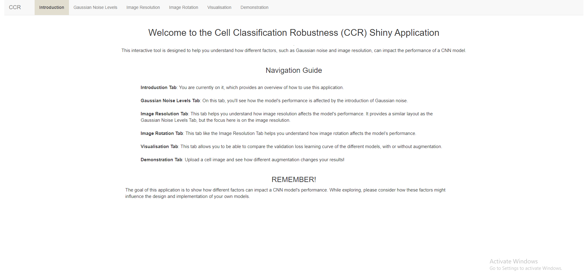

```{r setup, include=FALSE}
knitr::opts_chunk$set(echo = TRUE)
#knitr::opts_chunk$set(fig.pos = '!ht')
library(tidyverse)
library(ggpubr)
library(png)
library(EBImage)
val_loss <- read.csv("Image_App/val_loss.csv")
```

# Executive Summary

Short description of the problem.
The main findings.
Key figure if appropriate.
The practical relevance of the analysis.


# Aim and Background

A clear description of the problem, articulating the aim of this project.
Provides appropriate multidisciplinary context and motivational background explained well in an appropriate language. 
Including background of the data


# Method - Data Collection & Developed Models


Clear description of the approach in data collection, developed model, the evaluation strategies from a data-science perspective. Here we refer to all types of evaluation metrics including graphical, qualitative and quantitative metric.

A clear description of your innovation and approach to the scientific problem.

What is your approach and which tools are used and why? 

The dataset was generated by 10x Genomics Xenium instrument on a fresh frozen mouse brain coronal section. The data bundle contained various components, including a cell morphology image where the intensity corresponded to the presence of the nucleus in each cell, cell boundaries indicating the spatial locations of the detected cells, and RNA abundances for each cell. The cells were then grouped into 28 distinct clusters, and the cluster labels were provided (Reference to data bundle). An Rmarkdown file was employed to generate the images. This process involved utilising the cell boundaries of the detected cells along with their corresponding labels to create per-cell images for a randomly selected subset of 1000 cells.

Prior to integrating data augmentation into the training set, several preprocessing steps were employed to maximize the effectiveness of our approach. These steps were undertaken to optimize the dataset before the introduction of data augmentation. The preprocessing steps included the exclusion of noise beyond the cell boundary vertices associated with the cells. This process ensured that the resulting images exclusively contained the cell itself, without any extra elements or noise. Additionally, the images were subjected to a mask and resize, ensuring that each cell shared a uniform size and eliminating any inconsistencies in the image generation process. The pixel intesities were also centered in order to maintain consistency across all images. Moreover, considering the substantial number of cell clusters present in the dataset, the image data was augmented by doubling the samples from 1000 to 2000. This augmentation technique was implemented to expand the sample size while maintaining a minimal increase in training time.

## Baseline Model

Initially, a Random Forest classifier was employed, utilizing the pixel values of the provided images, to predict the corresponding cell clusters. However, the limited complexity of the model hindered its capability to capture the composite shapes of the cells, resulting in a error rate of 95%. Additionally, the high number of clusters within the dataset, totaling 28, further constrained its predictive performance.

## Data Augmentation Models


# Method - Evaluation Strategies 


# Results - Effect of Data Augmentation

## Gaussian Noise

```{r gausshist, eval=T, include=T, echo=F, fig.width = 15, fig.height = 15, align="center", fig.cap="Validation Loss for Different Gaussian Noise Levels on CNN Models.", fig.pos="H"}
level_order <- c("none", "low", "high", "random")

gaussian <- val_loss |> filter((noise_type == "gaussian" | noise_type == "none") & !grepl("Category", model))
gaussian_catent <- val_loss |> filter((noise_type == "gaussian" | noise_type == "none") & grepl("Category", model))

p1 <- ggplot(data = gaussian, aes(x = factor(noise_level, level = level_order), y = val_loss, fill = model)) +
       geom_bar(stat = "identity", position="dodge") +
       xlab("Gaussian Noise Level") + ylab("Validation Loss") +
       ggtitle("Comparison of Validation Loss on Binary and RMSprop Model")
p2 <- ggplot(data = gaussian_catent, aes(x = factor(noise_level, level = level_order), y = val_loss, fill = model)) + 
         geom_bar(stat = "identity", position="dodge") +
         xlab("Gaussian Noise Level") + ylab("Validation Loss") +
         ggtitle("Comparison of Validation Loss on Categorical Model")

level_order <- c("none", "low", "medium", "random")
    
resolution <- val_loss |> filter((noise_type == "resolution" | noise_type == "none") & !grepl("Category", model))
resolution_catent <- val_loss |> filter((noise_type == "resolution" | noise_type == "none") & grepl("Category", model))
    
p3 <- ggplot(data = resolution, aes(x = factor(noise_level, level = level_order), y = val_loss, fill = model)) +
       geom_bar(stat = "identity", position="dodge") +
       xlab("Resolution") + ylab("Validation Loss") +
       ggtitle("Comparison of Validation Loss on Binary and RMSprop Model")

p4 <- ggplot(data = resolution_catent, aes(x = factor(noise_level, level = level_order), y = val_loss, fill = model)) + 
               geom_bar(stat = "identity", position="dodge") +
               xlab("Resolution") + ylab("Validation Loss") +
               ggtitle("Comparison of Validation Loss on Categorical Model")

level_order <- c("none", "low", "high", "random")
    
resolution <- val_loss |> filter((noise_type == "rotation" | noise_type == "none") & !grepl("Category", model))

p5 <- ggplot(data = resolution, aes(x = factor(noise_level, level = level_order), y = val_loss, fill = model)) +
       geom_bar(stat = "identity", position="dodge") +
       xlab("Rotation") + ylab("Validation Loss") +
       ggtitle("Comparison of Validation Loss on Binary and RMSprop Model")

resolution_catent <- val_loss |> filter((noise_type == "rotation" | noise_type == "none") & grepl("Category", model))
    
p6 <- ggplot(data = resolution_catent, aes(x = factor(noise_level, level = level_order), y = val_loss, fill = model)) + 
       geom_bar(stat = "identity", position="dodge") +
       xlab("Rotation") + ylab("Validation Loss") +
       ggtitle("Comparison of Validation Loss on Categorical Model")

plot(ggarrange(p1, p2, p3, p4, p5, p6,
          ncol = 2, nrow=3))
```

Observing Figure 1, the introduction of Gaussian noise in the implementation resulted in an increase in validation loss across all models, as compared to the original model. Notably, the application of random mean Gaussian noise yielded the largest validation loss for both the binary and categorical models. Moreover, a high mean Gaussian noise of 0.8 was applied led to the highest validation loss for both the binary and categorical models with class weights. Finally, the inclusion of low mean Gaussian noise demonstrated the highest validation loss for the RMSprop models, both with and without class weights.

## Resolution

The incorporation of low (16x16) and medium (32x32) resolutions in the training set resulted in a reduction of validation loss across all models, as illustrated in Figure 2. Notably, the categorical models with class weights experienced the most substantial benefits from this augmentation, with a decrease of 0.7503 when low resolution was added and a decrease of 1.0054 when medium resolution was utilized. Conversely, the introduction of random resolution into the training set led to an increase in validation loss, particularly noticeable in the binary model, with an increase of 0.0309.

## Rotation

While the binary and RMSprop models showed an increase in validation loss with rotation, the categorical models, both with and without class weights, demonstrated a decrease in validation loss when low (90 degrees) and high (180 degrees) rotations were applied, as shown in Figure 3. Models with random image rotation experienced the highest validation loss across all models.

```{r sumtable, eval=T, include=T, echo=F, align="center", fig.cap="Summary Table of Validation Loss for All CNN Models.", fig.pos="H"}
sumtable <- readImage("images/table_summary.png")
display(sumtable, method="raster")
```

## Combining Data Augmentations

```{r learningcurve, eval=F, include=T, echo=F, align="center", fig.cap="Learning Curves of Models with Combined Data Augmentation Compared to Models with No Noise", fig.pos="H"}
lcurve <- readImage("images/combined_learning_curve.png")
display(lcurve, method = "raster")
```

The combination of all data augmentations resulted in a reduction of validation loss across all models, except for the RMSprop model without class weights, as indicated in the summary table presented in Figure 4. Additionally, Figure 5 highlights that the combined models achieved a flatter learning curve, indicating an improvement in mitigating overfitting of the dataset. Notably, the most significant improvement was observed in the models utilising categorical cross-entropy, both with and without class weights, with a respective decrease of 1.3457 (21.87%) and 0.8985 (16.29%) in validation loss.


As summarised in Figure 4, all models with class weights experiences a significant decrease in validation loss. This trend is particularly pronounced in the binary models, which experienced an average decrease of 0.05887 (23.10%) in validation loss. Similarly, models utilising the RMSprop optimizer without class weights display an average decrease of 0.05842 (23.04%) in validation loss. Moreover, models employing the RMSprop optimizer in conjunction with class weights demonstrate an average decrease of 0.0239 (12.45%) in validation loss.


# Results - Deployment 

All the plots above can be accessed through the [**CCR Shiny App**](https://usyd510436290.shinyapps.io/Image_App/).It consists of six tabs, the introduction tab, three separate tabs for a brief description of each noise and interactive bar chart results, one tab for the interactive visualisation of learning curves for every model used for this project, and one tab for to demonstrate an application of such tool. All interactive visualisation tools were created using plotly package in R (reference to plotly).

## Introduction

```{r eval=F, intro_scrnshot, echo=F, out.width="70%", out.height="20%",fig.cap="caption",fig.show='hold',fig.align='center', fig.cap="Screenshotof the Introduction tab in the CCR Shiny App"}

```

The introduction tab provides an overview of on the usage of the application, designed as a navigation guide for first time users.

## Choise of Noise

```{r eval=F, noise_scrnshot, echo=F, out.width="49%", out.height="20%",fig.cap="caption",fig.show='hold',fig.align='center', fig.cap="Screenshots of the Gaussian Noise level, Resolution and Rotation tab in the CCR Shiny App"}
knitr::include_graphics(c("images/Noise_Results.jpg","images/Resolution_Results.jpg", "images/Rotation_Results.jpg"))
```

Within the noise description and results tabs, each augmentation was accompanied by examples showcasing its effect on a cell image, allowing users to compare it with the original image. This visual representation served to illustrate the impact of the augmentation for users who may be unfamiliar with the technique. Subsequently, a justification for the selection of each augmentation was provided, explaining the reasoning behind its inclusion. Additionally, an interactive bar chart wass utilized to compare the validation loss of the models with the implemented augmentation. By hovering over each bar in the interactive plot, users can access the specific validation loss value. 

## Interactive Learning Curve Visualisation

This particular tab offers an interactive visualization of the learning curves for all the models employed in this project. By default, the plot displays the validation loss over 100 epochs for models trained without any noise augmentation. However, users have the freedom to select and compare different models of their choice. This interactive feature enables users to gain insights into the impact of various augmentations, model optimisers, and loss functions on the learning process of CNN models. 

```{r eval=F, intvis_scrnshot, echo=F, out.width="49%", out.height="30%",fig.cap="caption",fig.show='hold',fig.align='center', fig.cap="Screenshots of the Interactive Learning Curve Visualisation in the CCR Shiny App. Default (Top Left), Comparison between Low Gaussian Noise and Random Rotation (Top Right), and Comparison between Original Models and Combined Models (Bottom)."}
knitr::include_graphics(c("images/intvis_default.png","images/invis_gau_res.png", "images/intvis_comb.png"))
```

## Demonstration

```{r eval=F, demo_scrnshot, echo=F, out.width="49%", out.height="30%",fig.cap="caption",fig.show='hold',fig.align='center', fig.cap="Screenshots of the Demonstration Tab in the CCR Shiny App. Default (Top Left), Image with 0.2 mean Gaussian Noise (Top Right), and Combination of Different Augmentations (Bottom)."}
knitr::include_graphics(c("images/demo_default.png","images/demo_ex1.png", "images/demo_ex2.png"))
```

The demonstration tab provides users with the opportunity to upload a cell image and experiment with various data augmentations, such as different levels of Gaussian noise, rotation, and resolution changes. By applying these augmentations simultaneously, users can observe the resulting predicted cluster in the output tab. This interactive feature enables users to gain a better understanding of how different data augmentations affect the model's predictions, showcasing one of the many practical applications of this tool. All predictions are generated using the Combined CNN model, utilizing categorical cross-entropy as the loss function. 

# Discussion

How robust and generalizable is your finding or your product?

Discussion of potential shortcomings or issues associated with the development process or the product with reference to both disciplines. 

Identification of future work or improvement in both disciplines.

Furthermore, as can been seen in the confusion matricies in Figure (ref) ... (Talk about Combined model not overfitting)

```{r conf_matrix, echo=F, out.width="65%", out.height="30%",fig.cap="caption",fig.show='hold',fig.align='center', fig.cap="Confusion Matrix on Validation Set for Original CNN model (Left) and Combined CNN model (Right). Both models used Categorical Cross-Entropy as the loss function."}
knitr::include_graphics(c("images/Matrix_1.png","images/Matrix_2.png"))
```


# Conclusion


Conclusion adequately summarises the project and identification of future work.


\newpage

\footnotesize


# Student Contributions 


# References


\newpage

# Appendix 

Main code & technical details of your approach
